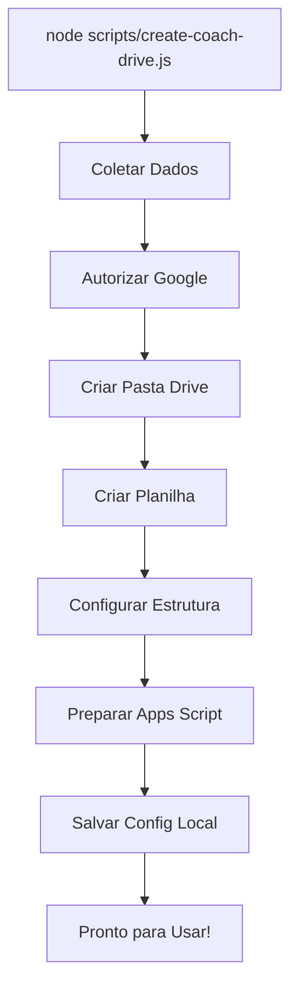

# ☁️ Configuração do Google Drive - Scout 21 Pro

Este guia explica como configurar a integração com Google Drive para criar automaticamente pastas e planilhas para cada treinador.

---

## 🎯 O que será criado automaticamente

Para cada treinador:
- ✅ **Pasta no Google Drive** com nome "Scout 21 Pro - [Nome do Time]"
- ✅ **Google Sheets** com 11 abas pré-configuradas
- ✅ **Headers** em cada aba
- ✅ **Dados iniciais** (competições, metas)
- ✅ **Apps Script** preparado (precisa apenas implantar)

---

## 📋 Pré-requisitos

1. Conta Google (Gmail)
2. Node.js instalado
3. Projeto Scout 21 Pro clonado

---

## 🚀 Passo a Passo

### 1. Criar Projeto no Google Cloud Console

1. Acesse: https://console.cloud.google.com
2. Clique em **Selecionar Projeto** (topo)
3. Clique em **Novo Projeto**
4. Nome do projeto: `Scout 21 Pro`
5. Clique em **Criar**

### 2. Habilitar APIs Necessárias

1. No menu lateral, vá em **APIs e Serviços** > **Biblioteca**

2. Busque e habilite estas 3 APIs:

#### a) Google Drive API
- Busque: `Google Drive API`
- Clique em **ATIVAR**

#### b) Google Sheets API
- Busque: `Google Sheets API`
- Clique em **ATIVAR**

#### c) Apps Script API (Opcional - para automação completa)
- Busque: `Apps Script API`
- Clique em **ATIVAR**

### 3. Criar Credenciais OAuth 2.0

1. Vá em **APIs e Serviços** > **Credenciais**
2. Clique em **+ CRIAR CREDENCIAIS**
3. Escolha **ID do cliente OAuth**

#### 3.1. Configurar Tela de Consentimento (se solicitado)

1. Tipo de usuário: **Externo**
2. Clique em **Criar**
3. Preencha:
   - **Nome do app:** Scout 21 Pro
   - **Email de suporte:** seu-email@gmail.com
   - **Domínios autorizados:** (deixe em branco)
   - **Email do desenvolvedor:** seu-email@gmail.com
4. Clique em **Salvar e Continuar**
5. Em **Escopos**, clique em **Adicionar ou Remover Escopos**
6. Adicione:
   - `https://www.googleapis.com/auth/drive.file`
   - `https://www.googleapis.com/auth/spreadsheets`
7. Clique em **Salvar e Continuar**
8. Em **Usuários de teste**, adicione seu email
9. Clique em **Salvar e Continuar**

#### 3.2. Criar ID do Cliente

1. Volte em **Credenciais**
2. Clique em **+ CRIAR CREDENCIAIS** > **ID do cliente OAuth**
3. Tipo de aplicativo: **Aplicativo para computador**
4. Nome: `Scout 21 Pro CLI`
5. Clique em **Criar**

#### 3.3. Baixar Credenciais

1. Após criar, aparecerá uma janela com o ID do cliente
2. Clique em **FAZER DOWNLOAD DO JSON**
3. Salve o arquivo como: `google-credentials.json`
4. Mova o arquivo para: `/Users/bno/Documents/gestaoesportiva/21Scoutpro/scripts/`

```bash
mv ~/Downloads/client_secret_*.json /Users/bno/Documents/gestaoesportiva/21Scoutpro/scripts/google-credentials.json
```

### 4. Instalar Dependências

```bash
cd /Users/bno/Documents/gestaoesportiva/21Scoutpro/scripts
npm install googleapis
```

Ou no diretório raiz:

```bash
cd /Users/bno/Documents/gestaoesportiva/21Scoutpro
npm install googleapis --save
```

### 5. Testar Autorização

```bash
cd /Users/bno/Documents/gestaoesportiva/21Scoutpro
node scripts/test-google-auth.js
```

Isso abrirá o navegador para você autorizar o acesso.

---

## 🎯 Criar Treinador com Google Drive

Agora você pode criar treinadores e tudo será configurado automaticamente:

```bash
node scripts/create-coach-drive.js
```

### O que acontece:

1. ✅ Coleta dados do treinador (nome, email, senha, etc)
2. ✅ Autoriza acesso ao Google Drive (primeira vez apenas)
3. ✅ Cria pasta no Google Drive
4. ✅ Cria Google Sheets na pasta
5. ✅ Adiciona 11 abas com headers
6. ✅ Adiciona dados iniciais (competições, metas)
7. ✅ Prepara código do Apps Script
8. ✅ Salva tudo localmente

### Resultado:

```
✅ TREINADOR CRIADO COM SUCESSO!

📁 Estrutura Local: data/coaches/joao@email.com
☁️  Pasta Drive: https://drive.google.com/drive/folders/XXXXX
📊 Planilha: https://docs.google.com/spreadsheets/d/YYYYY/edit
```

---

## 📝 Após Criar o Treinador

### 1. Implantar Google Apps Script

1. Abra a planilha (link fornecido)
2. Vá em **Extensões** > **Apps Script**
3. Cole o código do arquivo: `data/coaches/[email]/apps-script.js`
4. Clique em **Salvar**
5. Clique em **Implantar** > **Nova implantação**
6. Tipo: **Aplicativo da Web**
7. Configure:
   - **Executar como:** Eu (seu email)
   - **Quem tem acesso:** Qualquer pessoa
8. Clique em **Implantar**
9. **Copie a URL** gerada

### 2. Configurar URL no Sistema

Edite: `src/config.ts`

```typescript
export const API_URL = 'https://script.google.com/macros/s/SUA_URL/exec';
```

Ou crie configuração por treinador (multi-tenant).

---

## 🔐 Segurança

### Credenciais

- ✅ `google-credentials.json` - Contém apenas IDs públicos (client_id, client_secret)
- ✅ `google-token.json` - Criado após autorização, contém token de acesso
- ⚠️ **NUNCA** commite esses arquivos no Git!

Adicione ao `.gitignore`:

```
scripts/google-credentials.json
scripts/google-token.json
```

### Permissões

- Cada treinador tem sua própria pasta no Drive
- Permissões podem ser gerenciadas no Google Drive
- Apps Script tem acesso apenas à planilha específica

---

## 🆘 Solução de Problemas

### Erro: google-credentials.json não encontrado

```
❌ Arquivo google-credentials.json não encontrado!
```

**Solução:**
1. Verifique se o arquivo está em: `scripts/google-credentials.json`
2. Baixe novamente do Google Cloud Console
3. Renomeie para `google-credentials.json`

### Erro: Access denied

```
❌ Error: Access denied
```

**Solução:**
1. Verifique se você autorizou o aplicativo
2. Delete `google-token.json` e execute novamente
3. Certifique-se de que as APIs estão habilitadas
4. Adicione seu email como "Usuário de teste" na tela de consentimento

### Erro: API not enabled

```
❌ Google Drive API has not been used in project...
```

**Solução:**
1. Acesse o link fornecido no erro
2. Clique em **ATIVAR**
3. Execute o script novamente

### Token expirado

```
❌ Token has been expired or revoked
```

**Solução:**
```bash
rm scripts/google-token.json
node scripts/create-coach-drive.js
```

---

## 📊 Estrutura Criada

### Pasta no Google Drive

```
Scout 21 Pro - [Nome do Time]/
├── [Nome do Time] - Dados.xlsx   (Google Sheets)
└── (outros arquivos futuros)
```

### Google Sheets - Abas

1. `players` - Jogadores
2. `matches` - Partidas
3. `match_player_stats` - Stats por jogo
4. `injuries` - Lesões
5. `assessments` - Avaliações físicas
6. `schedules` - Programações
7. `schedule_days` - Dias das programações
8. `competitions` - Competições (com dados iniciais)
9. `stat_targets` - Metas (com dados iniciais)
10. `time_controls` - Controle de tempo
11. `championship_matches` - Tabela de campeonato

### Estrutura Local

```
data/coaches/[email]/
├── config.json              # Configuração completa
├── spreadsheet-id.txt       # ID da planilha
├── apps-script.js           # Código do Apps Script
└── README.md                # Instruções específicas
```

---

## 🔄 Fluxo Completo



---

## 📚 Referências

- [Google Drive API Docs](https://developers.google.com/drive/api/v3/about-sdk)
- [Google Sheets API Docs](https://developers.google.com/sheets/api)
- [Apps Script Docs](https://developers.google.com/apps-script)
- [OAuth 2.0](https://developers.google.com/identity/protocols/oauth2)

---

## 💡 Dicas

1. **Primeira vez:** A autorização abre o navegador
2. **Revogar acesso:** https://myaccount.google.com/permissions
3. **Ver pastas criadas:** https://drive.google.com
4. **Compartilhar pasta:** Adicione pessoas no Drive
5. **Backup:** Google Drive faz backup automático

---

**🏆 Com esta configuração, criar um novo treinador leva menos de 2 minutos!**

